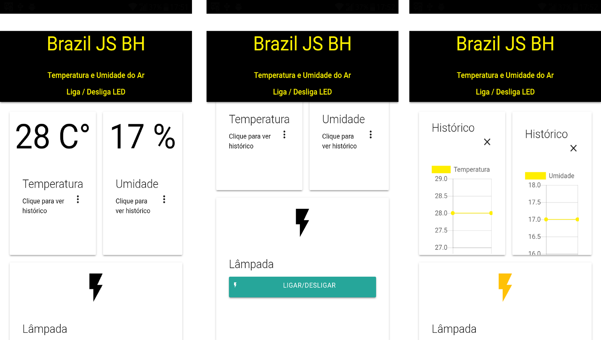

# Demo apresentação ao Brazil JS BH - Ionic + IoT + Firebase

## Telas / Screens: 

## Baseado neste [post](https://medium.com/@alvaroviebrantz/sensoriamento-realtime-com-firebase-e-esp8266-6e54b9bff1c1) 